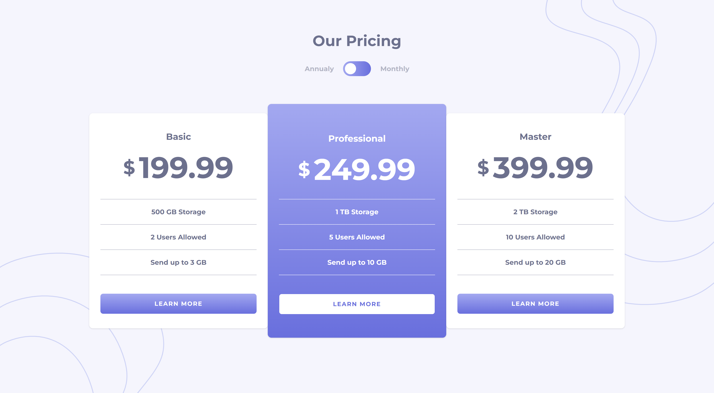

# Frontend Mentor - Componente de precio con ToggleButton

Esta es una solución para el challenge de Frontend Mentor (https://www.frontendmentor.io/challenges/pricing-component-with-toggle-8vPwRMIC).

## Table of contents

- [Descripción General](#overview)
  - [El challenge](#the-challenge)
  - [Screenshot](#screenshot)
  - [Links](#links)
- [Hecho con](#built-with)
- [Autor](#author)

## Descripción General

### El challenge

Los usuarios deben ser capaces de:

- Ver el diseño del componente de forma óptima en todos los tamaños de dispositivos.
- Visualizar los precios mensuales y anuales mediante el switch.

### Screenshot

### Links

- Live Site URL: https://prices-component.vercel.app/

### Hecho con

- React
- Tailwind CSS
- Flexbox
- Vite

## Autor

- Alejandro Di Donato
- Frontend Mentor - https://www.frontendmentor.io/profile/alejandrodidonato
